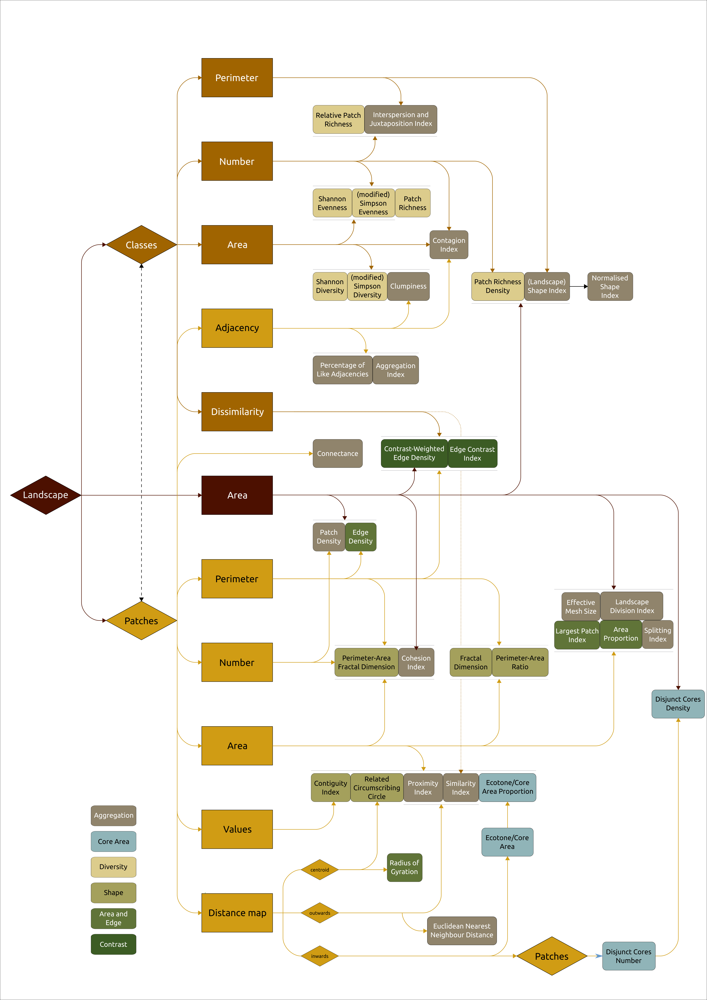

```{r, include = FALSE}
knitr::opts_chunk$set(
  collapse = TRUE,
  comment = "#>"
)
```

# Overview

Here you will find a brief description of *landscape metrics*. The first section outlines what they are, how they work and how they are used. The second section has an interactive table that allows you to specify search criteria to find just the metric you need for your project.

# What is a landscape metric and why


## Level of measurement


  1. *Cell*: As any map consists of "pixels" (which are called **cell**s here), their values can be the basis for analysing what is depicted by the map.
  2. *Patch*: An aggregation of (functionally or phenotypically) similar cell values that are all interconnected with each other. In the widely used *patch-matrix* model of landscapes, patches are regarded as islands in an ocean of other land cover types (the matrix). However, often the landscape is a mosaic of many different land cover types, and thus patches. Moreover, often gradients are prevailing (e.g. a gradual change from one land cover type to its neighbours). Thus often a clear distinction between patch and matrix is arbitrary and subjective rules have to be used to delimit patch from matrix.
  3. *Class*: All patches of the same cell value. For instance in a land cover map, the land use type would be depicted in classes. However, classes can also be derived based on various spatial computations.
  4. *Landscape*: The overall map.
  
## Generic versus specific metrics

Essentially, landscape metrics are equations that relate different aspects of a pattern in a certain way to one another. When breaking those equations down into their mathematical components, we find that there is a small set of characteristics from which all landscape metrics are derived, such as the area, the number and the perimeter of entities. Here, these smallest building blocks are called *generic metrics*. In detail, those currently are:

1) an adjacency matrix and the values of cells,
2) the area (of patches, classes and the landscape), 
3) the number and perimeter (of patches and classes) and
3) the dissimilarities between classes.

Those are represented by the functions `msr_area()`, `msr_number()`, `msr_perimeter()`, `msr_adjacency()` and `msr_values()`. As soon as a generic metric is called for a particular level and is combined with other generic metrics, this results in what is called *specific metric* here.

In practise this looks like follows. To calculate, for example, the *class proportional area* landscape metric for the gridded object `grd`, we first create the specific metrics *class area* and *landscape area*, and define their mathematical relation.

    ac = msr_area(obj = grd, scale = "class")
    al = msr_area(obj = grd, scale = "landscape")
    
    cpa = ac / al * 100

To formalise this in the scope of this package, we call the function `specify()`, which records those information in the respective object (here we can omit the `obj`). 

    cpa <- specify(ac = msr_area(scale = "class"),
                   al = msr_area(scale = "landscape"),
                   equation = ac / al * 100,
                   name = "class proportional area",
                   interpretation = "...")                  

This specific landscape metric can from now on be used, together with other specific metrics, in the `measure()` function, where a set of gridded objects (`obj`) is exposed to those metrics and other options are set.

## The dependence structure of landscape metrics

build something based on https://github.com/glin/reactable/

The following graph shows the relationship of all metrics defined primarily in @mcgarigal_fragstats_2015 and includes also various other metrics.

1) [Area and Edge](#area_and_edge)
2) [Shape](#shape)
3) [Core Area](#core_area)
4) [Contrast](#contrast)
5) Aggregation ([Dispersion](#dispersion), [Interspersion](#interspersion), [Subdivision](#subdivision), [Isolation](#isolation))
6) [Diversity](#diversity)




.


    specify(pc = msr_perimeter(scale = "class"),
            al = msr_area(scale = "landscape"),
            equation = pc / al * 10000,
            name = "edge density",
            interpretation = "higher values indicate higher spatial heterogeneity and possible fragmentation of the focal habitat type.")


    specify(np = msr_number(scale = "patch"),
            al = msr_area(scale = "landscape"),
            equation = np / al * 10000,
            name = "patch density",
            interpretation = "higher values indicate higher spatial fragmentation of a particular class.")


    specify(pp = msr_perimeter(scale = "patch"),
            ap = msr_area(scale = "patch"),
            equation = pp / ap * 10000,
            name = "perimeter-area ratio",
            interpretation = "")


    specify(gii = msr_adjacency(),
            gik = msr_adjacency(type = "pairedSum"),
            equation = gii / gik * 100,
            name = "percentage of like-adjacencies",
            interpretation = "lower values indicate higher disaggregation, where 0 means that each patch is a single cell. Hiher values indicate higher aggregation, where 100 means that the complete landscape is filled with this patch.")


# The landscape metrics

## Number {#lm_number}

Description: Number of objects.

Level of measurement: Patch, Class

    lm_number(obj, scale = "patch", layer = NULL)

Unit: $n$ per map

Range: $0 ≤ x < \infty$

Interpretation: 

Limitations: Number of cells in the raster.

Employed in the derived metrics: [Patch Density](#mDP)

Reference: -

  
## Area {#lm_area}

Description: Area of objects. 

Level of measurement: Patch, Class, Landscape

    lm_area(obj, scale = "patch", unit = "cells", layer = NULL)

Unit: $m^2$

Range: $0 ≤ x < \infty$

Interpretation: The area covered by specific objcets can be a very basic measure of landscapes, for instance as 'habitat amount', *patch size effect*.

Limitations: Spatial resolution and the number of cells of the raster.

Employed in the derived metrics: [Edge Density](#mDE), [Patch Density](#mDP), [Largest Patch Index](#mLPI), [Perimeter-Area ratio](#mPAR), Shape Index, Fractal Dimension, [Class Proportion of the Landscape](#mCPA), Disjunct Cores Density, Core Area Proportion

Reference: @turner_landscape_2001, @leitao_measuring_2006, @mcgarigal_fragstats_2015


## Perimeter (Edge Length) {#lm_perimeter}

Description: The enclosing perimeter of objects. Amount and distribution of edges informs many landscape metrics with respect to the patch-matrix model of landscapes.

Level of measurement: Patch, Class, Landscape

    lm_perimeter(obj, scale = "patch", unit = "cells", layer = NULL)

Unit: $m$

Range: $0 ≤ x < \infty$

Interpretation:

Limitations: Spatial resolution of the raster. Moreover, the perimeter in a raster map is typically larger than in the real world, where edges are typically not a sequence of corners.

Employed in the derived metrics: [Edge Density](#mDE), [Perimeter-Area ratio](#mPAR), Shape Index, Fractal Dimension

Reference: @turner_landscape_2001, @mcgarigal_fragstats_2015


## Adjacency {#lm_adjacency}

Description: Not a metric per se, this is a table of the frequency with which different pairs of values appear side by side in the raster. This is typically only applied at the level of cells. Of interest are 'like adjacencies', adjacencies between cells with the same value, and general adjacencies between each value and all of the values. Adjacencies can be counted based on single count (only cells to the right and bottom of the focal cell) or double count (additionally also cells to the left and top of the focal cell).

Level of measurement: 

    lm_adjacency(obj, type = "like", count = "double", layer = NULL)

Unit: $n$

Range: $0 ≤ x < \infty$

Interpretation:

Limitations: Spatial resolution of the raster.

Employed in the derived metrics: [Percentage of Like Adjacencies](#mPLA)

Reference: @mcgarigal_fragstats_2015


<!-- ## Value Distribution {#mValues} -->

<!-- Description:  -->

<!-- Level of measurement: -->

<!--     lm_values(...) -->

<!-- Unit:  -->

<!-- Range:  -->

<!-- Interpretation: -->

<!-- Limitations: - -->

<!-- Employed in the derived metrics:  -->

<!-- Reference:  -->


<!-- ## Metric distribution {#mMetrics} -->

<!-- Description: Second-order statistic of metric variation. This comprises mean, area-weighted mean, median, range, standard deviation, coefficient of variation, minimum, maximum or quantiles. -->

<!-- Level of measurement: Patch, Class, Landscape -->

<!--     lm_metrics(...) -->

<!-- Unit: depending on the measured metric -->

<!-- Range: depending on the measured metric -->

<!-- Interpretation: depending on the chosen statistic -->

<!-- Limitations: depending on the measured metric -->

<!-- Employed in the derived metrics: - -->

<!-- Reference: @mcgarigal_fragstats_2015 -->

</br>

# Derived metrics

## Area and Edge {#area_and_edge}
### Class proportion of the Landscape {#mCPA}

Description: Proportion of the landscape window occupied by each of the classes

\begin{equation} 
  CPA = \frac{A_C}{A_L} \cdot 100
\end{equation}
with $A_{C}$ = Area of a class, $A_L$ = Area of the landscape

    specify(ac = msr_area(scale = "class"),
            al = msr_area(scale = "landscape"),
            equation = ac / al * 100,
            name = "class proportional area",
            interpretation = "this metric approaches 0 (100) when the respective class becomes increasingly rare (frequent)")


### Largest Patch Index {#mLPI}

Description: Proportion of the landscape window occupied by the largest patch.

\begin{equation} 
  LPI = \frac{max(A_{P})}{A_L} \cdot 100
\end{equation}
with $max(A_{P})$ = Area of the largest patch, $A_L$ = Area of the landscape

    specify(ap = msr_area(scale = "patch"),
            al = msr_area(scale = "landscape"),
            equation = max(ap) / al * 100,
            name = "largest patch index",
            interpretation = "this is a measure of dominance that approaches 0 (100) when the largest patch is increasingly small (large).")


### Radius of Gyration {#mRG}

<!-- Description: Mean distance between each cell of a patch and its centroid. -->

<!-- Level of measurement:  -->

<!-- Internal name: radius of gyration (RG) -->

<!--   \begin{equation}  -->
<!--     RG =  -->
<!--   \end{equation} -->
<!-- with $$ = , $$ =  -->

<!--     someRCode(...) -->

<!-- Unit: $$ -->

<!-- Range: $$ -->

<!-- Interpretation:  -->

<!-- Limitations:  -->

<!-- Employed in the derived metrics:  -->

<!-- Reference:  -->


### Edge Density {#mDE}

Description: Length of edges per hectare of the landscape window.

Level of measurement: Class, Landscape

Internal name: density of edges (DE)

\begin{equation} 
  DE = \frac{P_{X}}{A_L} \cdot 10000
\end{equation}
with $P_{X}$ = [Perimeter](#lm_perimeter) of a patch or class, $A_L$ = [Area](#lm_area) of the landscape

    list(pC = list(operator = "lm_perimeter", scale = "class"),
         aL = list(operator = "lm_area", scale = "landscape"),
         mDE = "pC / aL * 10000")

Unit: $m\,ha^{-1}$

Range: $0 < DE ≤ \infty$

Interpretation: Higher values indicate higher spatial heterogeneity and possible fragmentation of the focal habitat type.

Limitations: 

Employed in the derived metrics: 

Reference:


## Shape {#shape}
### Perimeter-Area ratio {#mPAR}

Description: Ratio of the perimeter per area of each patch.

Level of measurement: Patch, Class, Landscape

Internal name: perimeter per area ratio (PAR)

\begin{equation} 
  PAR = \frac{P_P}{A_P} \cdot 10000
\end{equation}
with $P_P$ = [Perimeter](#lm_perimeter) of a patch, $A_P$ = [Area](#lm_area) of a patch

    list(pP = list(operator = "lm_perimeter", scale = "patch"),
         aP = list(operator = "lm_area", scale = "patch"),
         mPAR = "pP / aP * 10000")

Unit: $m\,ha^{-2}$

Range: $0 < PAR ≤ \infty$

Interpretation: 

Limitations: 

Employed in the derived metrics: 

Reference: 


### Fractal dimension {#mFD}

<!-- Description:  -->

<!-- Level of measurement:  -->

<!-- Internal name:  -->

<!--   \begin{equation}  -->
<!--     PLP =  -->
<!--   \end{equation} -->
<!-- with $$ = , $$ =  -->

<!--     someRCode(...) -->

<!-- Unit: $$ -->

<!-- Range: $$ -->

<!-- Interpretation:  -->

<!-- Limitations:  -->

<!-- Employed in the derived metrics:  -->

<!-- Reference:  -->


### Perimeter-Area Fractal Dimension {#mPAFD}

<!-- Description:  -->

<!-- Level of measurement:  -->

<!-- Internal name:  -->

<!--   \begin{equation}  -->
<!--     PLP =  -->
<!--   \end{equation} -->
<!-- with $$ = , $$ =  -->

<!--     someRCode(...) -->

<!-- Unit: $$ -->

<!-- Range: $$ -->

<!-- Interpretation:  -->

<!-- Limitations:  -->

<!-- Employed in the derived metrics:  -->

<!-- Reference:  -->


### Contiguity Index {#mCONTI}

<!-- Description:  -->

<!-- Level of measurement:  -->

<!-- Internal name: contiguity index (CII) -->

<!--   \begin{equation}  -->
<!--     PLP =  -->
<!--   \end{equation} -->
<!-- with $$ = , $$ =  -->

<!--     someRCode(...) -->

<!-- Unit: $$ -->

<!-- Range: $$ -->

<!-- Interpretation:  -->

<!-- Limitations:  -->

<!-- Employed in the derived metrics:  -->

<!-- Reference:  -->


### Related Circumscribing Circle {#mRCC}

<!-- Description:  -->

<!-- Level of measurement:  -->

<!-- Internal name: related circumscribing circle (RCC) -->

<!--   \begin{equation}  -->
<!--     RCC =  -->
<!--   \end{equation} -->
<!-- with $$ = , $$ =  -->

<!--     someRCode(...) -->

<!-- Unit: $$ -->

<!-- Range: $$ -->

<!-- Interpretation:  -->

<!-- Limitations:  -->

<!-- Employed in the derived metrics:  -->

<!-- Reference:  -->


## Core Area {#core_area}


### Core Area {#mAC}

<!-- Description:  -->

<!-- Level of measurement:  -->

<!-- Internal name: area of the core (AC) -->

<!--   \begin{equation}  -->
<!--     AC =  -->
<!--   \end{equation} -->
<!-- with $$ = , $$ =  -->

<!--     someRCode(...) -->

<!-- Unit: $$ -->

<!-- Range: $$ -->

<!-- Interpretation:  -->

<!-- Limitations:  -->

<!-- Employed in the derived metrics:  -->

<!-- Reference:  -->


### Core Area Proportion {#mPAC}

<!-- Description:  -->

<!-- Level of measurement:  -->

<!-- Internal name: proportion of core area (PCA) -->

<!--   \begin{equation}  -->
<!--     PCA =  -->
<!--   \end{equation} -->
<!-- with $$ = , $$ =  -->

<!--     someRCode(...) -->

<!-- Unit: $$ -->

<!-- Range: $$ -->

<!-- Interpretation:  -->

<!-- Limitations:  -->

<!-- Employed in the derived metrics:  -->

<!-- Reference:  -->


### Disjunct Cores Number {#mNDC}

<!-- Description:  -->

<!-- Level of measurement:  -->

<!-- Internal name: number of disjunct cores (NDC) -->

<!--   \begin{equation}  -->
<!--     NDC =  -->
<!--   \end{equation} -->
<!-- with $$ = , $$ =  -->

<!--     someRCode(...) -->

<!-- Unit: $$ -->

<!-- Range: $$ -->

<!-- Interpretation:  -->

<!-- Limitations:  -->

<!-- Employed in the derived metrics:  -->

<!-- Reference:  -->


### Disjunct Cores Density {#mDDC}

<!-- Description:  -->

<!-- Level of measurement:  -->

<!-- Internal name: density of disjunct cores (DDC) -->

<!--   \begin{equation}  -->
<!--     DDC =  -->
<!--   \end{equation} -->
<!-- with $$ = , $$ =  -->

<!--     someRCode(...) -->

<!-- Unit: $$ -->

<!-- Range: $$ -->

<!-- Interpretation:  -->

<!-- Limitations:  -->

<!-- Employed in the derived metrics:  -->

<!-- Reference:  -->


### Ecotone Area {#mAE}

<!-- Description:  -->

<!-- Level of measurement:  -->

<!-- Internal name: area of the ecotone (AE) -->

<!--   \begin{equation}  -->
<!--     AE =  -->
<!--   \end{equation} -->
<!-- with $$ = , $$ =  -->

<!--     someRCode(...) -->

<!-- Unit: $$ -->

<!-- Range: $$ -->

<!-- Interpretation:  -->

<!-- Limitations:  -->

<!-- Employed in the derived metrics:  -->

<!-- Reference:  -->

## Contrast {#contrast}


### Contrast Weighted Edge Density {#mWDE}

<!-- Description:  -->

<!-- Level of measurement:  -->

<!-- Internal name:  -->

<!--   \begin{equation}  -->
<!--     PLP =  -->
<!--   \end{equation} -->
<!-- with $$ = , $$ =  -->

<!--     someRCode(...) -->

<!-- Unit: $$ -->

<!-- Range: $$ -->

<!-- Interpretation:  -->

<!-- Limitations:  -->

<!-- Employed in the derived metrics:  -->

<!-- Reference:  -->


### Edge Contrast Index {#mECI}

<!-- Description:  -->

<!-- Level of measurement:  -->

<!-- Internal name: edge contrast index (ECI) -->

<!--   \begin{equation}  -->
<!--     ECI =  -->
<!--   \end{equation} -->
<!-- with $$ = , $$ =  -->

<!--     someRCode(...) -->

<!-- Unit: $$ -->

<!-- Range: $$ -->

<!-- Interpretation:  -->

<!-- Limitations:  -->

<!-- Employed in the derived metrics:  -->

<!-- Reference:  -->


## Aggregation: Dispersion {#dispersion}

### Percentage of Like Adjacencies {#mPLA}

Description: Percent of the adjacencies per class that are like adjacencies.

Level of measurement: Class

Internal name: percentage of like adjacencies (PLA)

  \begin{equation} 
    PLA = \frac{G_{ii}}{G_{ik}} \cdot 100
  \end{equation}
with $G_{ii}$ = [like Adjacencies](#lm_adjacency) based on double count, $G_{ik}$ = all (incl. like) [Adjacencies](#lm_adjacency) based on double count

    list(g_ii = list(operator = "lm_adjacency"),
         g_ik = list(operator = "lm_adjacency", type = "pairedSum"),
         mPLA = "g_ii / g_ik * 100")

Unit: $\%$

Range: $0 < PLA ≤ 100$

Interpretation: 

Limitations: Lower values indicate higher disaggregation, where 0 means that each patch is a single cell. Hiher values indicate higher aggregation, where 100 means that the complete landscape is filled with this patch.

Employed in the derived metrics: 

Reference: 


## Aggregation: Interspersion {#interspersion}

## Aggregation: Subdivision {#subdivision}

### Patch Density {#mDP}

Description: Number of patches per hectare of the landscape window.

Level of measurement: Class, Landscape

Internal name: density of patches (DP)

\begin{equation} 
  DP = \frac{N_P}{A_L} \cdot 10000
\end{equation}
with $N_P$ = [Number](#lm_number) of patches, $A_L$ = [Area](#lm_area) of the landscape

    list(nP = list(operator = "lm_number", scale = "patch"),
         aL = list(operator = "lm_area", scale = "landscape"),
         mDP = "nP / aL * 10000")

Unit: $n\,ha^{-1}$

Range: $0 < DP ≤ \infty$

Interpretation: Higher values indicate higher spatial fragmentation of a particular class.

Limitations: 

Employed in the derived metrics: 

Reference: @leitao_measuring_2006


## Aggregation: Isolation {#isolation}

## Diversity {#diversity}


### Relative Patch Richness {#mRNP}

<!-- Description:  -->

<!-- Level of measurement:  -->

<!-- Internal name:  -->

<!--   \begin{equation}  -->
<!--     PLP =  -->
<!--   \end{equation} -->
<!-- with $$ = , $$ =  -->

<!--     someRCode(...) -->

<!-- Unit: $$ -->

<!-- Range: $$ -->

<!-- Interpretation:  -->

<!-- Limitations:  -->

<!-- Employed in the derived metrics:  -->

<!-- Reference:  -->


### Shannon Diversity {#mDSHA}

<!-- Description:  -->

<!-- Level of measurement:  -->

<!-- Internal name:  -->

<!--   \begin{equation}  -->
<!--     PLP =  -->
<!--   \end{equation} -->
<!-- with $$ = , $$ =  -->

<!--     someRCode(...) -->

<!-- Unit: $$ -->

<!-- Range: $$ -->

<!-- Interpretation:  -->

<!-- Limitations:  -->

<!-- Employed in the derived metrics:  -->

<!-- Reference:  -->


### Shannon Evenness {#mESHA}

<!-- Description:  -->

<!-- Level of measurement:  -->

<!-- Internal name:  -->

<!--   \begin{equation}  -->
<!--     PLP =  -->
<!--   \end{equation} -->
<!-- with $$ = , $$ =  -->

<!--     someRCode(...) -->

<!-- Unit: $$ -->

<!-- Range: $$ -->

<!-- Interpretation:  -->

<!-- Limitations:  -->

<!-- Employed in the derived metrics:  -->

<!-- Reference:  -->


### Modified Simpson Diversity {#mDSIMM}

<!-- Description:  -->

<!-- Level of measurement:  -->

<!-- Internal name:  -->

<!--   \begin{equation}  -->
<!--     PLP =  -->
<!--   \end{equation} -->
<!-- with $$ = , $$ =  -->

<!--     someRCode(...) -->

<!-- Unit: $$ -->

<!-- Range: $$ -->

<!-- Interpretation:  -->

<!-- Limitations:  -->

<!-- Employed in the derived metrics:  -->

<!-- Reference:  -->


### Modified Simpson Evenness {#mESIMM}

<!-- Description:  -->

<!-- Level of measurement:  -->

<!-- Internal name:  -->

<!--   \begin{equation}  -->
<!--     PLP =  -->
<!--   \end{equation} -->
<!-- with $$ = , $$ =  -->

<!--     someRCode(...) -->

<!-- Unit: $$ -->

<!-- Range: $$ -->

<!-- Interpretation:  -->

<!-- Limitations:  -->

<!-- Employed in the derived metrics:  -->

<!-- Reference:  -->


### Patch Richness {#mNP}

<!-- Description:  -->

<!-- Level of measurement:  -->

<!-- Internal name:  -->

<!--   \begin{equation}  -->
<!--     PLP =  -->
<!--   \end{equation} -->
<!-- with $$ = , $$ =  -->

<!--     someRCode(...) -->

<!-- Unit: $$ -->

<!-- Range: $$ -->

<!-- Interpretation:  -->

<!-- Limitations:  -->

<!-- Employed in the derived metrics:  -->

<!-- Reference:  -->


### Patch Richness Density {#m}

<!-- Description:  -->

<!-- Level of measurement:  -->

<!-- Internal name:  -->

<!--   \begin{equation}  -->
<!--     PLP =  -->
<!--   \end{equation} -->
<!-- with $$ = , $$ =  -->

<!--     someRCode(...) -->

<!-- Unit: $$ -->

<!-- Range: $$ -->

<!-- Interpretation:  -->

<!-- Limitations:  -->

<!-- Employed in the derived metrics:  -->

<!-- Reference:  -->


## To complete and sort in
### Aggregation Index {#mAI}

<!-- Description:  -->

<!-- Level of measurement:  -->

<!-- Internal name:  -->

<!--   \begin{equation}  -->
<!--     PLP =  -->
<!--   \end{equation} -->
<!-- with $$ = , $$ =  -->

<!--     someRCode(...) -->

<!-- Unit: $$ -->

<!-- Range: $$ -->

<!-- Interpretation:  -->

<!-- Limitations:  -->

<!-- Employed in the derived metrics:  -->

<!-- Reference:  -->


### Class Dominance {#mDOM}

<!-- Description:  -->

<!-- Level of measurement:  -->

<!-- Internal name:  -->

<!--   \begin{equation}  -->
<!--     PLP =  -->
<!--   \end{equation} -->
<!-- with $$ = , $$ =  -->

<!--     someRCode(...) -->

<!-- Unit: $$ -->

<!-- Range: $$ -->

<!-- Interpretation:  -->

<!-- Limitations:  -->

<!-- Employed in the derived metrics:  -->

<!-- Reference:  -->


### Clumpiness {#mCLUM}

<!-- Description:  -->

<!-- Level of measurement:  -->

<!-- Internal name:  -->

<!--   \begin{equation}  -->
<!--     PLP =  -->
<!--   \end{equation} -->
<!-- with $$ = , $$ =  -->

<!--     someRCode(...) -->

<!-- Unit: $$ -->

<!-- Range: $$ -->

<!-- Interpretation:  -->

<!-- Limitations:  -->

<!-- Employed in the derived metrics:  -->

<!-- Reference:  -->


### Cohesion Index {#mCOH}

<!-- Description:  -->

<!-- Level of measurement:  -->

<!-- Internal name:  -->

<!--   \begin{equation}  -->
<!--     PLP =  -->
<!--   \end{equation} -->
<!-- with $$ = , $$ =  -->

<!--     someRCode(...) -->

<!-- Unit: $$ -->

<!-- Range: $$ -->

<!-- Interpretation:  -->

<!-- Limitations:  -->

<!-- Employed in the derived metrics:  -->

<!-- Reference:  -->


### Connectance {#mCONN}

<!-- Description:  -->

<!-- Level of measurement:  -->

<!-- Internal name:  -->

<!--   \begin{equation}  -->
<!--     PLP =  -->
<!--   \end{equation} -->
<!-- with $$ = , $$ =  -->

<!--     someRCode(...) -->

<!-- Unit: $$ -->

<!-- Range: $$ -->

<!-- Interpretation:  -->

<!-- Limitations:  -->

<!-- Employed in the derived metrics:  -->

<!-- Reference:  -->


### Contagion Index {#mCONTA}

<!-- Description:  -->

<!-- Level of measurement:  -->

<!-- Internal name:  -->

<!--   \begin{equation}  -->
<!--     PLP =  -->
<!--   \end{equation} -->
<!-- with $$ = , $$ =  -->

<!--     someRCode(...) -->

<!-- Unit: $$ -->

<!-- Range: $$ -->

<!-- Interpretation:  -->

<!-- Limitations:  -->

<!-- Employed in the derived metrics:  -->

<!-- Reference:  -->


### Effective Mesh Size {#mEMS}

<!-- Description:  -->

<!-- Level of measurement:  -->

<!-- Internal name:  -->

<!--   \begin{equation}  -->
<!--     PLP =  -->
<!--   \end{equation} -->
<!-- with $$ = , $$ =  -->

<!--     someRCode(...) -->

<!-- Unit: $$ -->

<!-- Range: $$ -->

<!-- Interpretation:  -->

<!-- Limitations:  -->

<!-- Employed in the derived metrics:  -->

<!-- Reference:  -->


### Interspersion and Juxtaposition Index {#mIJI}

<!-- Description:  -->

<!-- Level of measurement:  -->

<!-- Internal name:  -->

<!--   \begin{equation}  -->
<!--     PLP =  -->
<!--   \end{equation} -->
<!-- with $$ = , $$ =  -->

<!--     someRCode(...) -->

<!-- Unit: $$ -->

<!-- Range: $$ -->

<!-- Interpretation:  -->

<!-- Limitations:  -->

<!-- Employed in the derived metrics:  -->

<!-- Reference:  -->


### Landscape Division Index {#mLDI}

<!-- Description:  -->

<!-- Level of measurement:  -->

<!-- Internal name:  -->

<!--   \begin{equation}  -->
<!--     PLP =  -->
<!--   \end{equation} -->
<!-- with $$ = , $$ =  -->

<!--     someRCode(...) -->

<!-- Unit: $$ -->

<!-- Range: $$ -->

<!-- Interpretation:  -->

<!-- Limitations:  -->

<!-- Employed in the derived metrics:  -->

<!-- Reference:  -->


### Linearity Index {#mLI}

<!-- Description:  -->

<!-- Level of measurement:  -->

<!-- Internal name:  -->

<!--   \begin{equation}  -->
<!--     PLP =  -->
<!--   \end{equation} -->
<!-- with $$ = , $$ =  -->

<!--     someRCode(...) -->

<!-- Unit: $$ -->

<!-- Range: $$ -->

<!-- Interpretation:  -->

<!-- Limitations:  -->

<!-- Employed in the derived metrics:  -->

<!-- Reference:  -->


### Mean 5 Neighbour Distance {#mMND}

<!-- Description:  -->

<!-- Level of measurement:  -->

<!-- Internal name:  -->

<!--   \begin{equation}  -->
<!--     PLP =  -->
<!--   \end{equation} -->
<!-- with $$ = , $$ =  -->

<!--     someRCode(...) -->

<!-- Unit: $$ -->

<!-- Range: $$ -->

<!-- Interpretation:  -->

<!-- Limitations:  -->

<!-- Employed in the derived metrics:  -->

<!-- Reference:  -->


### Mean Distribution Distance {#mMDD}

<!-- Description:  -->

<!-- Level of measurement:  -->

<!-- Internal name:  -->

<!--   \begin{equation}  -->
<!--     PLP =  -->
<!--   \end{equation} -->
<!-- with $$ = , $$ =  -->

<!--     someRCode(...) -->

<!-- Unit: $$ -->

<!-- Range: $$ -->

<!-- Interpretation:  -->

<!-- Limitations:  -->

<!-- Employed in the derived metrics:  -->

<!-- Reference:  -->


### Normalized Shape Index {#mNSI}

<!-- Description:  -->

<!-- Level of measurement:  -->

<!-- Internal name:  -->

<!--   \begin{equation}  -->
<!--     PLP =  -->
<!--   \end{equation} -->
<!-- with $$ = , $$ =  -->

<!--     someRCode(...) -->

<!-- Unit: $$ -->

<!-- Range: $$ -->

<!-- Interpretation:  -->

<!-- Limitations:  -->

<!-- Employed in the derived metrics:  -->

<!-- Reference:  -->


### Nearest Neighbour Distance {#mNND}

<!-- Description:  -->

<!-- Level of measurement:  -->

<!-- Internal name: nearest neighbour distance (NND) -->

<!--   \begin{equation}  -->
<!--     NND =  -->
<!--   \end{equation} -->
<!-- with $$ = , $$ =  -->

<!--     someRCode(...) -->

<!-- Unit: $$ -->

<!-- Range: $$ -->

<!-- Interpretation:  -->

<!-- Limitations:  -->

<!-- Employed in the derived metrics:  -->

<!-- Reference:  -->


### Net Product {#mNET}

<!-- Description:  -->

<!-- Level of measurement:  -->

<!-- Internal name:  -->

<!--   \begin{equation}  -->
<!--     PLP =  -->
<!--   \end{equation} -->
<!-- with $$ = , $$ =  -->

<!--     someRCode(...) -->

<!-- Unit: $$ -->

<!-- Range: $$ -->

<!-- Interpretation:  -->

<!-- Limitations:  -->

<!-- Employed in the derived metrics:  -->

<!-- Reference:  -->


### Proximity Index {#mPI}

<!-- Description:  -->

<!-- Level of measurement:  -->

<!-- Internal name: proximity index (PI) -->

<!--   \begin{equation}  -->
<!--     PI =  -->
<!--   \end{equation} -->
<!-- with $$ = , $$ =  -->

<!--     someRCode(...) -->

<!-- Unit: $$ -->

<!-- Range: $$ -->

<!-- Interpretation:  -->

<!-- Limitations:  -->

<!-- Employed in the derived metrics:  -->

<!-- Reference:  -->


### Shape Index {#mSHAPE}

<!-- Description:  -->

<!-- Level of measurement:  -->

<!-- Internal name: shape index (SHAPE) -->

<!--   \begin{equation}  -->
<!--     SHI =  -->
<!--   \end{equation} -->
<!-- with $$ = , $$ =  -->

<!--     someRCode(...) -->

<!-- Unit: $$ -->

<!-- Range: $$ -->

<!-- Interpretation:  -->

<!-- Limitations:  -->

<!-- Employed in the derived metrics:  -->

<!-- Reference:  -->


### Similarity Index {#mSIMI}

<!-- Description:  -->

<!-- Level of measurement:  -->

<!-- Internal name: similarity index (SIMI) -->

<!--   \begin{equation}  -->
<!--     SIMI =  -->
<!--   \end{equation} -->
<!-- with $$ = , $$ =  -->

<!--     someRCode(...) -->

<!-- Unit: $$ -->

<!-- Range: $$ -->

<!-- Interpretation:  -->

<!-- Limitations:  -->

<!-- Employed in the derived metrics:  -->

<!-- Reference:  -->


### Simpson Diversity {#mDSIM}

<!-- Description:  -->

<!-- Level of measurement:  -->

<!-- Internal name:  -->

<!--   \begin{equation}  -->
<!--     PLP =  -->
<!--   \end{equation} -->
<!-- with $$ = , $$ =  -->

<!--     someRCode(...) -->

<!-- Unit: $$ -->

<!-- Range: $$ -->

<!-- Interpretation:  -->

<!-- Limitations:  -->

<!-- Employed in the derived metrics:  -->

<!-- Reference:  -->


### Simpson Evenness {#mESIM}

<!-- Description:  -->

<!-- Level of measurement:  -->

<!-- Internal name:  -->

<!--   \begin{equation}  -->
<!--     PLP =  -->
<!--   \end{equation} -->
<!-- with $$ = , $$ =  -->

<!--     someRCode(...) -->

<!-- Unit: $$ -->

<!-- Range: $$ -->

<!-- Interpretation:  -->

<!-- Limitations:  -->

<!-- Employed in the derived metrics:  -->

<!-- Reference:  -->


### Splitting Density {#mSD}

<!-- Description:  -->

<!-- Level of measurement:  -->

<!-- Internal name:  -->

<!--   \begin{equation}  -->
<!--     PLP =  -->
<!--   \end{equation} -->
<!-- with $$ = , $$ =  -->

<!--     someRCode(...) -->

<!-- Unit: $$ -->

<!-- Range: $$ -->

<!-- Interpretation:  -->

<!-- Limitations:  -->

<!-- Employed in the derived metrics:  -->

<!-- Reference:  -->


### Splitting Index {#mSI}

<!-- Description:  -->

<!-- Level of measurement:  -->

<!-- Internal name:  -->

<!--   \begin{equation}  -->
<!--     PLP =  -->
<!--   \end{equation} -->
<!-- with $$ = , $$ =  -->

<!--     someRCode(...) -->

<!-- Unit: $$ -->

<!-- Range: $$ -->

<!-- Interpretation:  -->

<!-- Limitations:  -->

<!-- Employed in the derived metrics:  -->

<!-- Reference:  -->


# References
